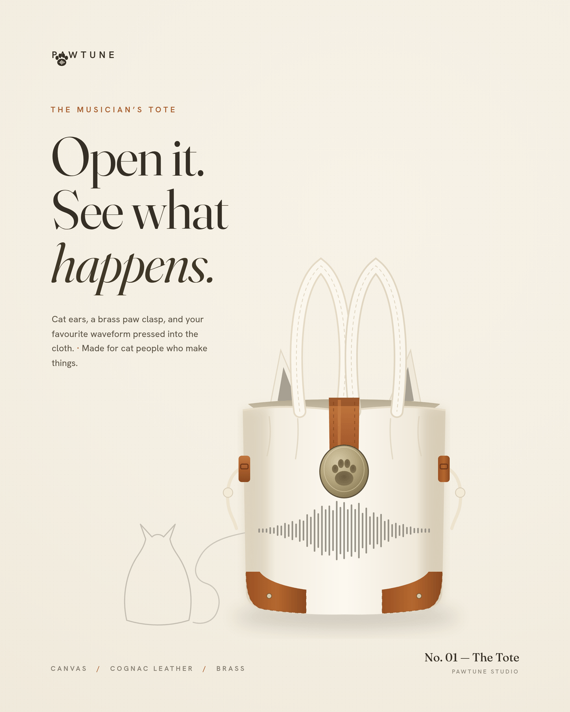

# PAWTUNE — Instagram feed post

A single Instagram feed post (1080 × 1350, 4:5 portrait) for **PAWTUNE**, a
canvas musician's tote for cat-owning creatives.



## The idea

Quiet-luxury, indie-music editorial — a boutique campaign crossed with a record
label poster, not a typical e-commerce ad. The product sits slightly off-centre
on a warm cream backdrop with a soft natural shadow and generous breathing room.

**The hook:** the bag's own soundwave print trails off the left edge of the
product and quietly resolves into the faint outline of a *sitting cat* in the
lower-left corner — small and easy to miss on first glance. It's meant to reward
a second look rather than shout.

## Brand spec used

| Token            | Value     | Use                          |
| ---------------- | --------- | ---------------------------- |
| Cream canvas     | `#F4EFE3` | background                   |
| Cognac leather   | `#A85C2E` | accents / straps / corners   |
| Charcoal ink     | `#352F26` | display + body type          |
| Pewter grey      | `#9A9488` | soundwave + the hidden cat   |

- **Display:** [Fraunces](https://fonts.google.com/specimen/Fraunces) (high
  optical size) — headline *"Open it. See what happens."* with **happens** in italic.
- **Supporting:** [Hanken Grotesk](https://fonts.google.com/specimen/Hanken+Grotesk)
  — eyebrow, sub-copy and footer, small and restrained.
- **Logo:** a thumbnail paw-and-soundwave mark, top-left.

## Files

```
design/
  pawtune_instagram_post.html   # the design, hand-built in HTML/SVG (the source)
  pawtune_instagram_post.png    # final export, 1080×1350
  render.js                     # renders the HTML → PNG (2× supersampled)
assets/fonts/                   # bundled OFL fonts (Fraunces, Hanken Grotesk)
```

## Re-rendering

```bash
cd design
npm install playwright sharp        # browsers already present in the web env
node render.js                      # → design/pawtune_instagram_post.png
```

The illustration (tote, soundwave print, and the soundwave→cat signature line)
is drawn in SVG, so the layout, copy and colours can be tweaked directly in the
HTML and re-rendered. Fonts are bundled under the SIL Open Font License (see the
`OFL-*.txt` files in `assets/fonts/`).
